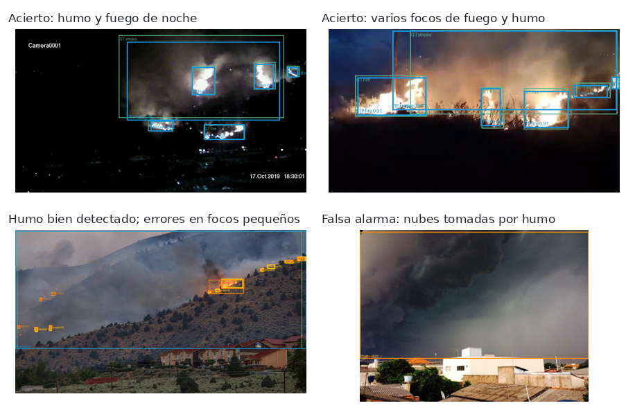
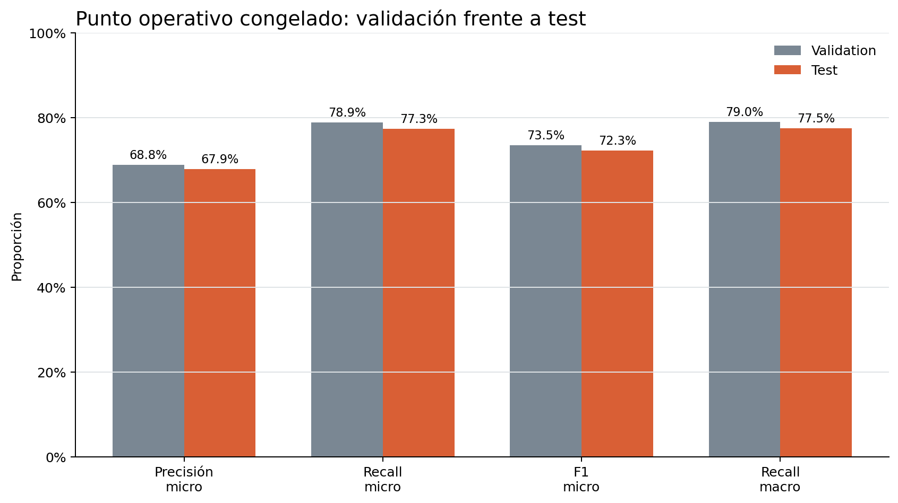

# Vigía: detección de humo y fuego con visión artificial

Trabajo Fin de Máster de Elías Ruiz Fernández (Máster en Big Data, Data Science e Inteligencia Artificial, 2026).

Vigía es un sistema de visión por computador que detecta humo y fuego en imágenes, vídeos o cámaras en directo. Usa un modelo de detección de objetos **YOLO26s** entrenado con el dataset público **D-Fire**. Cuando detecta humo o fuego de forma continuada durante unos segundos, genera una alerta y, si se configura, envía un aviso por Telegram con una captura. El proyecto incluye también una versión optimizada para ejecutarse en dispositivos con recursos limitados (Raspberry Pi 5).

A continuación se muestra cómo ejecutar cada parte del proyecto y un resumen de los resultados del modelo.



*Ejemplos del modelo final sobre imágenes de test de D-Fire. Azul: detección correcta. Naranja: detección incorrecta. Verde: caja real detectada. Amarillo: caja real no detectada.*

## Contenido del repositorio

```text
├── Memoria_TFM_Elias_Ruiz_Fernandez.pdf   Memoria del TFM
├── fire_app/                Aplicación web Vigía (API, interfaz y alertas)
├── notebooks/               Notebooks con todo el proceso: datos, entrenamiento, evaluación
├── artifacts/               Modelo final entrenado y ficheros del dataset preparado
├── results/                 Tablas y figuras de la evaluación final
├── deployment/              Instalación en Raspberry Pi 5 y modelo NCNN
├── configs/                 Configuración de experimentos y de la aplicación
├── tools/                   Scripts usados por los notebooks (evaluación, comparativas, exportación)
├── tests/                   Pruebas automáticas
├── tfm_*.py                 Código común de datos, evaluación y umbrales (lo usan notebooks y tools)
├── docker/                  Imagen Docker de los notebooks y dependencias fijadas
├── Dockerfile               Imagen Docker de la aplicación
├── compose.yaml             Arranque de la aplicación
├── compose.notebooks.yaml   Arranque de Jupyter Lab para los notebooks
├── compose.gpu.yaml         Da acceso a la GPU NVIDIA al entorno de los notebooks
├── requirements-app.txt     Dependencias de la aplicación (sin Docker)
└── .env.example             Plantilla para activar los avisos por Telegram
```

El modelo final entrenado está incluido en `artifacts/14_final_model_freeze/final/weights/best.pt`, así que **no hace falta entrenar nada para usar la aplicación**. Su huella SHA-256 está registrada en `artifacts/14_final_model_freeze/final/freeze_manifest.json` y la aplicación la comprueba antes de cargar el modelo.

### Dos entornos Docker

El repositorio tiene dos entornos Docker independientes, cada uno para una cosa:

| Entorno | Para qué sirve | Necesita GPU | Comando | Dirección |
|---|---|---|---|---|
| **Aplicación** | Probar Vigía con el modelo final | No | `docker compose up --build` | <http://127.0.0.1:8000> |
| **Notebooks** | Preparar el dataset, entrenar y evaluar los modelos | Solo para entrenar o evaluar | `docker compose -f compose.notebooks.yaml -f compose.gpu.yaml up -d --build` | <http://127.0.0.1:8888/lab> |

Usan puertos distintos, así que pueden estar en marcha a la vez. La sección 1 explica el de la aplicación y la sección 4 el de los notebooks.

---

## 1. Ejecutar la aplicación con Docker

Es la forma más sencilla de probar el proyecto. No necesita GPU ni descargar el dataset.

### Requisitos

- [Docker Desktop](https://www.docker.com/products/docker-desktop/) (Windows o macOS) o Docker Engine con Docker Compose v2 (Linux).
- Un ordenador con procesador x86-64 (Intel o AMD). En Mac, solo se ha probado con procesador Intel.
- Unos 8 GB de RAM y 6 GB libres en disco.

### Pasos

1. Descargar el repositorio:

   ```bash
   git clone https://github.com/Elitron22/vigia_fire_detection.git
   cd vigia_fire_detection
   ```

2. Construir y arrancar la aplicación:

   ```bash
   docker compose up --build
   ```

   Sin indicar ningún fichero, Docker Compose usa `compose.yaml`, que es el de la aplicación. La primera vez tarda varios minutos porque descarga las dependencias. Las siguientes veces arranca en segundos.

3. Abrir en el navegador <http://127.0.0.1:8000>.

4. Para pararla, pulsar `Ctrl+C` en la terminal o ejecutar:

   ```bash
   docker compose down
   ```

### Cómo usar la aplicación

La interfaz tiene tres pestañas:

- **Imagen**: se sube una foto y la aplicación muestra la imagen con las cajas de humo y fuego detectadas.
- **Vídeo**: se sube un vídeo y la aplicación muestra el vídeo anotado, que se puede ver y descargar desde el propio reproductor. Si el humo o el fuego se mantienen durante unos segundos, se registra una alerta (como máximo un aviso por vídeo).
- **Cámara**: usa la cámara del ordenador desde el navegador y analiza la imagen en directo con la misma regla de alerta que el vídeo. El navegador pedirá permiso para usar la cámara.

En «Ajustes avanzados», el selector «Modelo de detección» tiene dos opciones:

- **`yolo26s · 768 px · pytorch · final`**: el modelo final del TFM. Es el que se usa por defecto y el que se ha evaluado en test.
- **`yolo26s · 640 px · ncnn · final`**: una versión más rápida del mismo modelo, pensada para la Raspberry Pi 5.

Cada modelo usa sus propios umbrales de confianza para decidir cuándo una detección cuenta (humo 0,36 y fuego 0,16 para el modelo PyTorch; humo 0,365 y fuego 0,165 para el NCNN). Estos valores se eligieron en la fase de validación, como se explica en la sección de resultados.

Los resultados y el registro de alertas se guardan en la carpeta `runtime/` del repositorio. La aplicación también ofrece una API; su documentación interactiva está en <http://127.0.0.1:8000/docs> y el estado del servicio en <http://127.0.0.1:8000/api/health>.

---

## 2. Activar los avisos por Telegram (opcional)

Por defecto la aplicación funciona en modo simulación: registra las alertas pero no envía nada. Para recibir avisos reales:

1. Conseguir el token de un bot de Telegram. Sirve cualquier bot ya creado; si no se tiene ninguno, se crea en un minuto hablando con [@BotFather](https://t.me/BotFather), que da el token al terminar.
2. Obtener el identificador del chat donde se quieren recibir los avisos. Para ello, enviar un mensaje cualquiera al bot (por ejemplo `/start`) y abrir en el navegador `https://api.telegram.org/bot<token>/getUpdates`: el número que aparece en `"chat":{"id": ...}` es el identificador.
3. Copiar el fichero de ejemplo y rellenarlo:

   ```bash
   cp .env.example .env
   ```

   En el símbolo del sistema de Windows (cmd), el comando es `copy .env.example .env`.

   ```text
   TFM_TELEGRAM_MODE=live
   TELEGRAM_BOT_TOKEN=<token del bot>
   TELEGRAM_CHAT_ID=<identificador del chat>
   ```

4. Volver a arrancar con `docker compose up --build`. En la interfaz, el botón «Enviar mensaje de prueba» (dentro de «Diagnóstico del sistema») envía un mensaje para comprobar que todo está bien configurado.

Cada aviso incluye la clase detectada (humo o fuego), la confianza, el momento y una captura con las detecciones. El fichero `.env` no se sube al repositorio.

---

## 3. Conseguir el dataset D-Fire

Solo es necesario para volver a entrenar o evaluar los modelos. La aplicación no lo necesita.

El dataset no se incluye en el repositorio por su tamaño. Se descarga desde su repositorio oficial:

<https://github.com/gaia-solutions-on-demand/DFireDataset>

Tiene licencia CC0 1.0. Contiene 21.527 imágenes (17.221 de entrenamiento y 4.306 de test) anotadas con cajas de dos clases: humo (`smoke`) y fuego (`fire`).

Una vez descargado, se coloca dentro del repositorio en `data/D-Fire`, con esta estructura (el entorno Docker de los notebooks lo encuentra ahí automáticamente):

```text
data/D-Fire/
├── train/
│   ├── images/
│   └── labels/
└── test/
    ├── images/
    └── labels/
```

El notebook 01 lee estas carpetas sin modificarlas y crea la versión preparada del dataset. Para la validación se aparta el 10 % de las imágenes de entrenamiento (semilla 42), lo que deja 15.500 imágenes de entrenamiento, 1.721 de validación y 4.306 de test. La lista de qué imagen va a cada partición y las correcciones de anotaciones ya están guardadas en `artifacts/datasets/dfire_seed42_val10_v1/`.

---

## 4. Reproducir los experimentos con los notebooks

Los notebooks contienen todo el proceso del TFM. Están guardados con sus resultados, así que **se pueden leer directamente en GitHub o en Jupyter sin ejecutar nada**. Por defecto, las partes costosas (entrenar o evaluar) están desactivadas; en los notebooks que las tienen, se activan cambiando una variable al principio (por ejemplo `RUN_TRAINING=True`).

Para volver a ejecutarlos, hay que tener en cuenta que los resultados intermedios (modelos entrenados en `artifacts/experiments/` y otras carpetas de `artifacts/`) no están en el repositorio por su tamaño. Con una copia limpia se pueden ejecutar el 07 (con el modelo final incluido) y el 01 y el 02 (con el dataset); el resto necesita repetir antes los pasos anteriores. `notebooks/README.md` lo detalla.

Para ejecutarlos hay un entorno Docker propio, distinto del de la aplicación: incluye PyTorch 2.12.1 con CUDA 13.0, Ultralytics, Jupyter Lab y el resto de dependencias con las versiones exactas usadas en el TFM. Es el mismo entorno con el que se entrenaron los modelos.

### Requisitos

- Docker Desktop (Windows o macOS) o Docker Engine con Docker Compose v2 (Linux), en un ordenador x86-64.
- Unos 20 GB libres en disco para la imagen y las cachés.
- El dataset D-Fire en `data/D-Fire` si se van a ejecutar los notebooks que lo usan (ver sección 3).
- Para entrenar o evaluar modelos, además:
  - Una GPU NVIDIA. Los modelos del TFM se entrenaron con una RTX 5070 de 12 GB.
  - Un controlador NVIDIA compatible con CUDA 13.0 (versión 580.88 o superior en Windows, 580.65.06 o superior en Linux).
  - Docker con acceso a la GPU. En Windows, Docker Desktop con WSL 2 lo configura automáticamente. En Linux hay que instalar [NVIDIA Container Toolkit](https://docs.nvidia.com/datacenter/cloud-native/container-toolkit/latest/install-guide.html) y reiniciar Docker.
  - Docker Compose 2.30 o posterior, porque `compose.gpu.yaml` usa el atributo `gpus` (cualquier Docker Desktop reciente lo incluye).

### Pasos

1. Si se va a usar el dataset, colocarlo antes en `data/D-Fire` (sección 3).

2. Construir y arrancar el entorno desde la raíz del repositorio.

   Con GPU, para entrenar o evaluar:

   ```bash
   docker compose -f compose.notebooks.yaml -f compose.gpu.yaml up -d --build
   ```

   Sin GPU, para abrir los notebooks y consultar los resultados guardados:

   ```bash
   docker compose -f compose.notebooks.yaml up -d --build
   ```

   La primera vez descarga la imagen de PyTorch con CUDA (varios GB) y tarda un rato.

3. Opcionalmente, comprobar que el contenedor detecta la GPU:

   ```bash
   docker compose -f compose.notebooks.yaml -f compose.gpu.yaml exec notebook python /usr/local/bin/verify_tfm_environment.py
   ```

4. Abrir Jupyter Lab en <http://127.0.0.1:8888/lab>, entrar en la carpeta `notebooks/` y seguir el orden de la tabla de abajo.

   La carpeta del repositorio se monta dentro del contenedor, así que todo lo que generen los notebooks (modelos entrenados, tablas, figuras) se guarda directamente en el repositorio, dentro de `artifacts/`.

5. Para pararlo:

   ```bash
   docker compose -f compose.notebooks.yaml down
   ```

### Orden de los notebooks

| Notebook | Para qué sirve |
|---|---|
| `01_DFire_preparacion_dataset` | Revisa el dataset, corrige anotaciones erróneas y crea las particiones de entrenamiento, validación y test. |
| `02_DFire_entrenamiento_modelos` | Entrena los modelos YOLO (YOLOv8n, YOLOv8s, YOLO26n, YOLO26s). |
| `03_DFire_evaluacion_modelos` | Evalúa cada modelo sobre validación y compara los resultados iniciales. |
| `05_DFire_barrido_umbrales` | Prueba distintos umbrales de confianza y mide cuántas falsas alarmas genera cada uno. |
| `06_DFire_comparacion_resolucion` | Compara entrenar y evaluar a 640, 768 y 1024 píxeles. |
| `07_DFire_pruebas_manual_inferencia` | (Opcional) Aplica un modelo a una imagen o vídeo cualquiera. |
| `08_DFire_optimizacion_hiperparametros_YOLO26s` | Prueba pequeños cambios de hiperparámetros sobre YOLO26s. |
| `09_DFire_seleccion_final_validacion` | Elige el modelo final y sus umbrales usando solo validación. |
| `10_DFire_comparacion_todos_modelos_1pct` | Comprueba la elección comparando todas las configuraciones con el mismo criterio. |
| `11_DFire_evaluacion_final_test` | Evaluación final del modelo elegido sobre test (se hizo una sola vez). |
| `12_DFire_interpretabilidad_modelo` | Muestra qué zonas de la imagen usa el modelo para decidir (Eigen-CAM y oclusión). |

No hay notebook 04: era un análisis que se descartó y no influyó en el resultado final. En `notebooks/README.md` se explica cada notebook con más detalle.

### Sin Docker

También se puede montar el entorno a mano con Python 3.12:

1. Crear y activar un entorno virtual desde la raíz del repositorio: `python -m venv .venv` y, después, `.venv\Scripts\activate` en Windows o `source .venv/bin/activate` en Linux y macOS.
2. Instalar PyTorch 2.12.1 y torchvision 0.27.1 con soporte CUDA siguiendo <https://pytorch.org/get-started/locally/>.
3. Instalar el resto de dependencias: `pip install -r docker/requirements.txt`.
4. Abrir Jupyter desde la raíz del repositorio: `jupyter lab`.

Los notebooks encuentran automáticamente la carpeta del proyecto si se abren desde dentro del repositorio. Si no, se puede indicar con la variable de entorno `TFM_PROJECT_ROOT`. Si el dataset no está en `data/D-Fire`, su ubicación se indica con `TFM_DATASET_ROOT`.

---

## 5. Resultados del modelo

### Cómo se eligió el modelo

Se entrenaron cuatro modelos (YOLOv8n, YOLOv8s, YOLO26n y YOLO26s) y se probaron distintas resoluciones de imagen. Todas las decisiones se tomaron con la partición de **validación**; la de **test** se usó una sola vez, al final, para medir el resultado.

El criterio fue detectar el mayor número posible de incendios (**recall**) sin superar un 1 % de imágenes sin humo ni fuego en las que salte una alarma. En un sistema de aviso temprano es peor no detectar un incendio real que dar una falsa alarma, pero demasiadas falsas alarmas harían el sistema inútil.

El modelo elegido fue **YOLO26s entrenado y evaluado a 768 píxeles**, con un umbral de confianza de **0,36 para humo** y **0,16 para fuego**. Una detección solo se tiene en cuenta si su confianza alcanza o supera el umbral de su clase.

### Resultados en test

Sobre las 4.306 imágenes de test:

| Métrica | Global | Humo | Fuego |
|---|---:|---:|---:|
| Precisión | 67,88 % | 84,41 % | 58,26 % |
| Recall | 77,32 % | 79,45 % | 75,61 % |
| F1 | 72,29 % | 81,85 % | 65,81 % |
| mAP50 | 79,27 % | 85,67 % | 72,86 % |
| mAP50-95 | 46,38 % | 53,65 % | 39,10 % |

En la columna «Global», la precisión, el recall y el F1 se calculan juntando las detecciones de las dos clases; el mAP50 y el mAP50-95 son la media de humo y fuego.

- **Precisión**: de todo lo que el modelo marca como humo o fuego, qué parte es correcta.
- **Recall**: de todo el humo y fuego que hay realmente en las imágenes, qué parte encuentra el modelo.
- **F1**: combinación de precisión y recall en una sola cifra.
- **mAP50 y mAP50-95**: métricas estándar en detección de objetos que no dependen del umbral elegido; mAP50-95 además exige que las cajas estén bien ajustadas.

De las 2.005 imágenes de test sin humo ni fuego, el modelo dio alarma en 21 (1,05 %), ligeramente por encima del objetivo del 1 % fijado en validación. Los umbrales no se cambiaron después de ver este resultado.

El fuego es más difícil que el humo: aparece a menudo como focos pequeños y se confunde con luces o reflejos, lo que explica su menor precisión. La mayoría de falsas alarmas se producen con nubes, niebla, reflejos o iluminación intensa, y la mayoría de fallos de detección con humo o fuego pequeño, tapado o con poco contraste.



Los resultados en test son solo algo peores que en validación, lo que indica que el modelo generaliza bien a imágenes que no había visto.

### Rendimiento en Raspberry Pi 5

| Versión del modelo | Resolución | Tiempo por imagen | Imágenes por segundo |
|---|---:|---:|---:|
| PyTorch | 768 px | 2.621,36 ms | 0,381 |
| NCNN | 768 px | 252,04 ms | 3,968 |
| NCNN | 640 px | 167,41 ms | 5,973 |

El modelo PyTorch original es demasiado lento para la Raspberry Pi. Convertido a NCNN (un formato optimizado para procesadores ARM) y a 640 píxeles alcanza casi 6 imágenes por segundo. Como la conversión cambia ligeramente las confianzas, sus umbrales se recalcularon con validación (humo 0,365 y fuego 0,165) para mantener las falsas alarmas por debajo del 1 %. Las instrucciones para instalar las dos versiones en la Raspberry Pi están en `deployment/README.md`.

### Dónde están los resultados completos

- `results/final_test/`: evaluación en test, con tablas CSV y figuras.
- `results/interpretability/`: análisis de qué zonas de la imagen usa el modelo.
- `results/rpi5/`: medidas de velocidad y comparación de las versiones NCNN.
- Los resultados de las etapas anteriores (comparación de modelos, resoluciones, umbrales) están dentro de los notebooks correspondientes.

---

## Más documentación

- [Memoria del TFM](Memoria_TFM_Elias_Ruiz_Fernandez.pdf).
- `notebooks/README.md`: explicación detallada de cada notebook.
- `fire_app/README.md`: funcionamiento interno de la aplicación, regla de alertas, API y cómo lanzar sus pruebas automáticas.
- `deployment/README.md`: instalación en Raspberry Pi 5.

## Autor

Elías Ruiz Fernández, 2026.

## Vídeo de presentación

Presentación del proyecto en vídeo: <https://youtu.be/P9GD5GUJ5vE>
